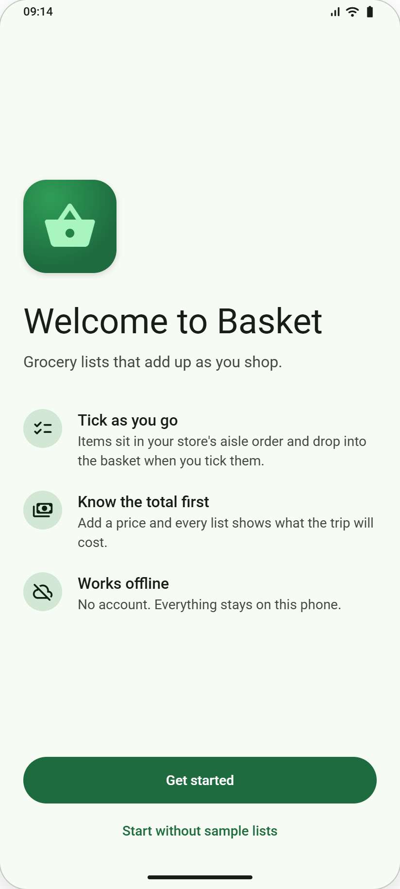
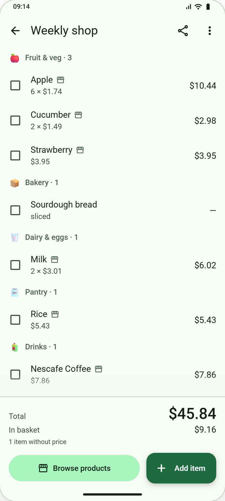
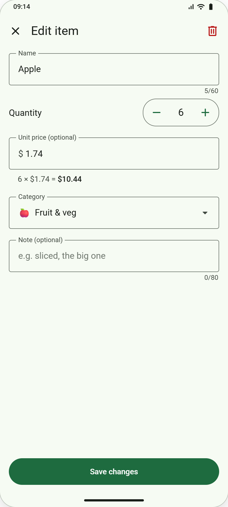
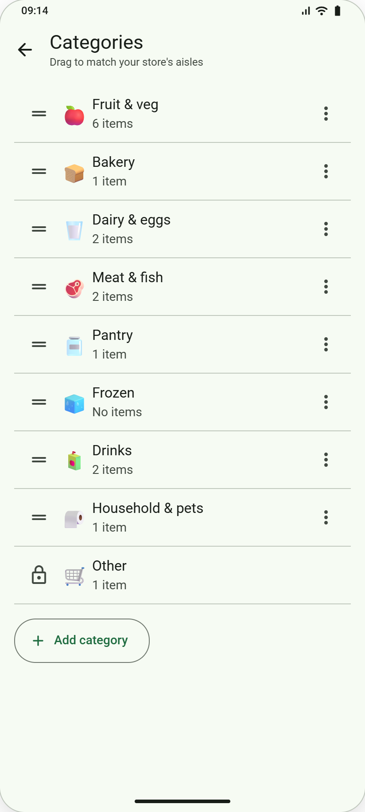
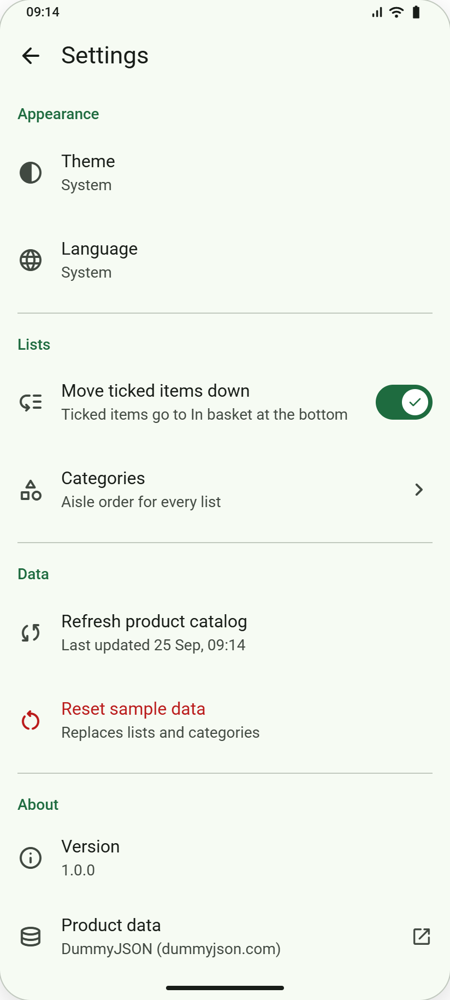

# Basket for iOS

Offline-first grocery shopping lists: keep several lists, add items by hand or from the DummyJSON groceries catalog, tick them off aisle by aisle and always see what the trip costs. Lists live on the phone; only the catalog comes from the internet. English, Spanish and Arabic.

<table>
<tr><td align="center"></td><td align="center"></td><td align="center"></td><td align="center"></td></tr>
<tr><td align="center">Welcome</td><td align="center">Lists</td><td align="center">List detail</td><td align="center">Add / edit item</td></tr>
<tr><td align="center"></td><td align="center"></td><td align="center"></td><td align="center"></td></tr>
<tr><td align="center">Browse products</td><td align="center">Product detail</td><td align="center">Categories</td><td align="center">Settings</td></tr>
</table>

The designs are drawn Android-first; the iOS app uses the native equivalent of each control.

## Run it

Xcode 15.0+ (Swift 5.9) · iOS 16.0+ · iPhone, portrait.

1. Open `Basket.xcodeproj`, pick the **Basket** scheme and an iPhone simulator, and press ⌘R. Run the tests with ⌘U.
2. From the command line:

```sh
cd BasketCore && swift test                      # product-rule tests only
xcodebuild -project Basket.xcodeproj -scheme Basket \
  -destination 'platform=iOS Simulator,name=iPhone 15' build test CODE_SIGNING_ALLOWED=NO
```

To run on a device, choose your team under Signing & Capabilities. `project.yml` regenerates an equivalent project with `xcodegen generate`.

## Project

- **Stack:** SwiftUI (`NavigationStack`) · Core Data with a programmatic model · `URLSession` async/await · `AsyncImage` + `URLCache` · `Localizable.strings` / `.stringsdict` · XCTest. No third-party dependencies.
- **Layout:** `Basket/` is the app (App, Theme, Components, Persistence, Network, Screens, Resources). `BasketCore/` is a Swift package with the product rules (`BasketRules.swift`) and their tests; its sources are also compiled into the app.
- **Data:** sample lists in `Basket/Resources/sample-data.json`; catalog from `https://dummyjson.com/products/category/groceries` (no key); `groceries.json` in the BasketCore tests is a saved response for tests only.
- **CI:** `.github/workflows/ios.yml` runs `swift test`, then builds and tests the app on an iPhone 15 simulator (Xcode 15.4) on every push.

## Testing tips

| To test | Do this |
|---|---|
| Offline | Device: Airplane Mode. Simulator: turn off the Mac's network, or Network Link Conditioner → 100% Loss |
| Spanish / Arabic | Settings → Language in the app |
| Dark theme | Settings → Theme → Dark in the app |
| Largest text | Settings → Accessibility → Display & Text Size → Larger Text; in the simulator, Xcode's Environment Overrides |
| Screen reader | VoiceOver (device), or the Accessibility Inspector (simulator) |
| First launch again | Delete the app and run it again |

## Tickets

31 bug reports and 5 feature requests. Tickets use the sample lists: tap **Get started** on first launch, or **Settings → Reset sample data**.

### Overview

| ID | Type | Screen | Ticket |
|---|---|---|---|
| [BK-101](#bk-101) | Bug | Lists | Card says "1 items without price" |
| [BK-102](#bk-102) | Bug | Lists | Card total doesn't match the list |
| [BK-103](#bk-103) | Bug | Lists | Progress bar is full at "3 of 10" |
| [BK-104](#bk-104) | Bug | Lists | Deleted a list by mistake and there's no Undo |
| [BK-105](#bk-105) | Bug | List detail | Ticked items stay in the middle of the list |
| [BK-106](#bk-106) | Bug | List detail | Swiping Milk removed a different item |
| [BK-107](#bk-107) | Bug | List detail | Undo after removing an item does nothing |
| [BK-108](#bk-108) | Bug | List detail | Sourdough bread shows $0.00 |
| [BK-109](#bk-109) | Bug | Browse → List detail | Apple is $1.74 in Browse but $1.73 on my list |
| [BK-110](#bk-110) | Bug | List detail | "Clear basket" deleted my whole list |
| [BK-111](#bk-111) | Bug | List detail | Aisles are in alphabetical order |
| [BK-112](#bk-112) | Bug | List detail | Sharing an empty list crashes the app |
| [BK-113](#bk-113) | Bug | Add / edit item | Editing an item makes a copy of it |
| [BK-114](#bk-114) | Bug | Add / edit item | Quantity can go to 0 and −1 |
| [BK-115](#bk-115) | Bug | Add / edit item | In Spanish, 1,99 becomes 199,00 |
| [BK-116](#bk-116) | Bug | Add / edit item | Back after saving opens the form again |
| [BK-117](#bk-117) | Bug | Add / edit item | Double-tapping Save adds the item twice |
| [BK-118](#bk-118) | Bug | Browse products | Browse shows a sofa, a bed and perfume |
| [BK-119](#bk-119) | Bug | Browse products | Searching "apple" shows iPhones |
| [BK-120](#bk-120) | Bug | Browse products | The app crashes without internet |
| [BK-121](#bk-121) | Bug | Browse products | Offline, Browse forgets the products it already loaded |
| [BK-122](#bk-122) | Bug | Browse products | Adding one Beef Steak adds 43 |
| [BK-123](#bk-123) | Bug | Browse products | Adding Apple again makes a second Apple row |
| [BK-124](#bk-124) | Bug | Browse products | Green Chili Pepper doesn't say "Low stock" |
| [BK-125](#bk-125) | Bug | Categories | Deleting a category deleted its items |
| [BK-126](#bk-126) | Bug | Settings | Dark theme turns off after reopening the app |
| [BK-127](#bk-127) | Bug | Whole app | Spanish is half English, and prices use "$" |
| [BK-128](#bk-128) | Bug | Whole app | Arabic isn't right-to-left |
| [BK-129](#bk-129) | Bug | Whole app | Dark mode has white rows and cards |
| [BK-130](#bk-130) | Bug | Whole app | Prices are cut off with large text |
| [BK-131](#bk-131) | Bug | Whole app | VoiceOver says just "Button" |
| [BK-201](#bk-201) | Feature | New screen | Spending by aisle |
| [BK-202](#bk-202) | Feature | New button | Untick all |
| [BK-203](#bk-203) | Feature | New functionality | Quick add on List detail |
| [BK-204](#bk-204) | Feature | New text | Item count under the list name |
| [BK-205](#bk-205) | Feature | New button | Share a list from the Lists screen |

### Bug reports

<a id="bk-101"></a>

#### BK-101 · Card says "1 items without price"

| **Screen** | Lists |
|---|---|
| **Reported by** | QA |
| **Description** | Each card on Lists summarises one shopping list: its name, how far the trip is, the estimated total and, when some items have no price yet, a small note such as "+ 1 without price" so the shopper knows the total is incomplete. Every count in the app must read naturally in English, Spanish and Arabic, in the singular and the plural. |
| **Steps** | 1. Open **Lists**.<br>2. Look at the **Weekly shop** card, under the total. |
| **Expected** | "+ 1 without price". Every count is grammatical in English, Spanish and Arabic ("1 item", "2 items"). |
| **Actual** | The card reads "+ 1 items without price". It is wrong English on the very first screen, and the same kind of mistake appears for other counts and in Spanish and Arabic, whose plural rules differ from English (Arabic has six plural forms). It makes the app look unfinished, and store reviewers and QA report it straight away. |

<a id="bk-102"></a>

#### BK-102 · Card total doesn't match the list

| **Screen** | Lists |
|---|---|
| **Reported by** | App review, 2★ |
| **Description** | The total on a list card is the estimated cost of the whole trip: for every item with a price, quantity × unit price, added up. It must always be exactly the same amount as the **Total** in the List detail footer, so people can compare and budget their lists without opening each one. |
| **Steps** | 1. Open **Lists** and note the total on the **Weekly shop** card.<br>2. Open **Weekly shop** and look at the footer. |
| **Expected** | The card and the footer show the same total: **$45.84** for Weekly shop and **$102.91** for BBQ Saturday. |
| **Actual** | The card shows **$30.47** for Weekly shop (the list says $45.84) and **$33.58** for BBQ Saturday (the list says $102.91). The two screens disagree about the same list, so the user can't trust either number. Worse, the card is always lower: someone who budgets from the Lists screen takes too little money to the store. |

<a id="bk-103"></a>

#### BK-103 · Progress bar is full at "3 of 10"

| **Screen** | Lists |
|---|---|
| **Reported by** | QA |
| **Description** | The progress bar on each card shows how much of the trip is done: items in the basket divided by all items on the list. "3 of 10 in basket" fills 30% of the bar; only "10 of 10" fills it completely and shows Done. The bar exists so people can see progress at a glance without reading. |
| **Steps** | 1. Open **Lists**.<br>2. Look at the **Weekly shop** card: "3 of 10 in basket". |
| **Expected** | The bar is 30% filled (3 of 10). |
| **Actual** | The bar is completely full as soon as a single item is ticked. The bar and the text next to it contradict each other, and the bar, the part people actually glance at, says the trip is finished while 7 items are still to buy. Shoppers relying on it can leave the store without everything they need. |

<a id="bk-104"></a>

#### BK-104 · Deleted a list by mistake and there's no Undo

| **Screen** | Lists |
|---|---|
| **Reported by** | Support |
| **Description** | Delete, in the ⋮ menu of a list card, removes the list immediately. Like every destructive action in Basket, it is only allowed to be instant because a message then offers **Undo** for 5 seconds. Undo must bring the list back exactly as it was: items, ticks, prices, notes and its position on Lists. |
| **Steps** | 1. Open **Lists**.<br>2. Tap ⋮ on **BBQ Saturday** → **Delete**. |
| **Expected** | The list disappears and the message "BBQ Saturday deleted" offers **Undo** for 5 seconds. Undo brings the list back exactly as it was (items, ticks, position). |
| **Actual** | The message "BBQ Saturday deleted" appears, but without Undo. The list and every item on it are gone for good. Delete sits right next to Rename and Duplicate, so a mis-tap destroys a list the user may have built up over weeks, with no confirmation and no way to recover it. |

<a id="bk-105"></a>

#### BK-105 · Ticked items stay in the middle of the list

| **Screen** | List detail |
|---|---|
| **Reported by** | App review, 3★ |
| **Description** | The setting **Move ticked items down** (on by default) keeps the "to buy" part of a list short while shopping. When an item is ticked it moves into the **In basket** section at the bottom of the list; unticking it moves it back into its aisle. With the setting off, ticked items stay in their aisle, struck through. |
| **Steps** | 1. Check that **Settings → Move ticked items down** is on (it is by default).<br>2. Open **Weekly shop** and tick **Apple**. |
| **Expected** | Apple moves into the **In basket** section at the bottom ("In basket · 4"). Unticking moves it back into its aisle. |
| **Actual** | Apple stays in Fruit & veg, struck through, and there is no In basket section at all. The list never gets shorter as you shop, so people keep scrolling past items they already have. The setting also does nothing: switching it on or off changes nothing on screen, which users report as broken. |

<a id="bk-106"></a>

#### BK-106 · Swiping Milk removed a different item

| **Screen** | List detail |
|---|---|
| **Reported by** | Support |
| **Description** | Swiping a row is the quick way to take an item off a list. It must remove exactly the row that was swiped, and the message "Milk removed" offers Undo for 5 seconds. |
| **Steps** | 1. Open **Weekly shop**.<br>2. Swipe **Milk** to reveal Delete and remove it. |
| **Expected** | Milk is removed and "Milk removed" offers Undo. |
| **Actual** | A different item disappears, and Milk is still on the list. The removed item is often in another aisle, off screen, so the user doesn't notice. They remove something they still need to buy and only find out at home that it is missing. It is silent data loss that looks like the user's own mistake. |

<a id="bk-107"></a>

#### BK-107 · Undo after removing an item does nothing

| **Screen** | List detail |
|---|---|
| **Reported by** | QA |
| **Description** | After an item is removed, the message at the bottom offers **Undo** for 5 seconds. Undo must put back the same item in the same place, with the same quantity, price, note and tick. Undo is what makes one-swipe removal safe. |
| **Steps** | 1. Open **Weekly shop**.<br>2. Remove any item by swiping it.<br>3. Tap **Undo** on the message straight away. |
| **Expected** | The item comes back in the same place, with the same quantity, price, note and tick. |
| **Actual** | Tapping Undo does nothing: the message disappears and the item stays removed. Swipes happen by accident while scrolling, and Undo is the only safety net. Without it, every accidental swipe means retyping the item, its price and its note. |

<a id="bk-108"></a>

#### BK-108 · Sourdough bread shows $0.00

| **Screen** | List detail |
|---|---|
| **Reported by** | PO |
| **Description** | Items can be added without a price, for example bread from the bakery counter. Such an item shows "—" instead of a price and adds nothing to the totals. The footer then says "1 item without price" under the totals, so the shopper knows the total is incomplete and which items still need a price. |
| **Steps** | 1. Open **Weekly shop**.<br>2. Look at **Sourdough bread** (it has no price) and at the footer. |
| **Expected** | The row shows "—" instead of a price, and the footer says "1 item without price" under the totals. |
| **Actual** | The row shows **$0.00** and the footer says nothing. $0.00 claims the bread is free, which is simply wrong. The total looks complete when it isn't, so the shopper under-budgets and can't tell which items still need a price. |

<a id="bk-109"></a>

#### BK-109 · Apple is $1.74 in Browse but $1.73 on my list

| **Screen** | Browse → List detail |
|---|---|
| **Reported by** | App review, 2★ |
| **Description** | Browse shows the price you pay for each product: the catalog price minus its discount, rounded to the nearest cent (Apple: $1.99 − 12.62% = **$1.74**). Tapping + adds the product to the open list at exactly that price, so the list total matches what the shopper saw in Browse and on Product detail. |
| **Steps** | 1. Open **Camping trip** → **Browse products**.<br>2. The Apple card shows **$1.74** (was $1.99). Tap **+** on Apple.<br>3. Go back to the list. |
| **Expected** | Apple's unit price on the list is **$1.74**, the same as the price shown in Browse. |
| **Actual** | The list shows Apple at **$1.73**, one cent less than Browse. Several other products are also a cent lower once added (for example Eggs, Cucumber, Potatoes and Strawberry). It sounds small, but the list no longer matches the price the shopper was shown, the error multiplies with quantity and adds up across items, and money must be exact to the cent. Every total built from catalog items is slightly wrong. |

<a id="bk-110"></a>

#### BK-110 · "Clear basket" deleted my whole list

| **Screen** | List detail |
|---|---|
| **Reported by** | App review, 1★ |
| **Description** | **Clear basket** (List detail → ⋮) tidies a list after a trip. It removes only the items that are ticked (already in the basket), at once, and the message "3 items removed" offers **Undo** for 5 seconds. Everything still to buy stays on the list. |
| **Steps** | 1. Open **Weekly shop** (3 items are ticked).<br>2. Tap ⋮ → **Clear basket**. |
| **Expected** | Only the 3 ticked items are removed, at once, and the message "3 items removed" offers **Undo** for 5 seconds. The 7 items still to buy stay. |
| **Actual** | All 10 items are removed, including the 7 that haven't been bought yet, and there is no Undo. The action does far more than its name says: one tap empties the whole list, and the only way back is to rebuild it from memory. |

<a id="bk-111"></a>

#### BK-111 · Aisles are in alphabetical order

| **Screen** | List detail |
|---|---|
| **Reported by** | PO |
| **Description** | Items are grouped by aisle in the order set on the **Categories** screen, so the list follows the shopper's walk through their own store. The default order is Fruit & veg, Bakery, Dairy & eggs, Meat & fish, Pantry, Frozen, Drinks, Household & pets, Other. When the user reorders categories, every list regroups immediately. |
| **Steps** | 1. Open **Weekly shop** and look at the aisle order.<br>2. Go to **Settings → Categories**, move **Drinks** to the top (drag, or ⋮ → Move up), and go back to the list. |
| **Expected** | Aisles follow the order on the Categories screen: Fruit & veg, Bakery, Dairy & eggs, … After moving Drinks to the top, Drinks comes first. |
| **Actual** | Aisles are alphabetical (Bakery, Dairy & eggs, Drinks, Fruit & veg, Household & pets, Pantry), and reordering Categories changes nothing. This breaks the app's main promise from the Welcome screen, that items sit in your store's aisle order. Shoppers zig-zag through the store, and the Categories screen seems to save their order but has no effect. |

<a id="bk-112"></a>

#### BK-112 · Sharing an empty list crashes the app

| **Screen** | List detail |
|---|---|
| **Reported by** | Crash report |
| **Description** | **Share** sends the list as plain text through the system share sheet (list name, items to buy, items in the basket, total). A list with no items has nothing to share, so Share is disabled there. |
| **Steps** | 1. Open **Camping trip** (it has no items).<br>2. Tap **Share**. |
| **Expected** | Share is disabled on an empty list. The app never crashes. |
| **Actual** | The app closes. Every new list starts empty, so this is easy to hit, and a crash is the worst possible outcome of tapping a button. Crashes also show up in the store's crash reports and pull the rating down. |

<a id="bk-113"></a>

#### BK-113 · Editing an item makes a copy of it

| **Screen** | Add / edit item |
|---|---|
| **Reported by** | Support |
| **Description** | Tapping an item opens **Edit item** with its current values. **Save changes** updates that same item in place; the list keeps one row per item. |
| **Steps** | 1. Open **Weekly shop** and tap the **Apple** row.<br>2. Change the quantity from 6 to 7 and tap **Save changes**. |
| **Expected** | One Apple row with quantity 7. |
| **Actual** | The list now has two rows, Apple × 6 and Apple × 7. The total goes up by $12.18 instead of $1.74, because both rows count. Every edit adds another copy, so lists fill up with duplicates and people buy the same thing twice. |

<a id="bk-114"></a>

#### BK-114 · Quantity can go to 0 and −1

| **Screen** | Add / edit item |
|---|---|
| **Reported by** | QA |
| **Description** | The quantity of an item is a whole number from 1 to 99. The − button is disabled at 1 and + is disabled at 99, and a typed quantity is kept within the same range. |
| **Steps** | 1. Open any list → **Add item**.<br>2. Tap **−** on the quantity a few times. |
| **Expected** | The quantity stops at 1 and − is disabled there. + stops at 99. A typed quantity is kept between 1 and 99. |
| **Actual** | The quantity goes to 0, −1 and lower, and the item can be saved like that. A quantity of 0 or less means nothing on a shopping list. With a price, a negative quantity even gives a negative line total and lowers the list total, so the totals are wrong. |

<a id="bk-115"></a>

#### BK-115 · In Spanish, 1,99 becomes 199,00

| **Screen** | Add / edit item |
|---|---|
| **Reported by** | App review, 1★ (Spain) |
| **Description** | The unit price field accepts the decimal separator of the app language. English users type "1.99", Spanish users type "1,99", and both mean one dollar ninety-nine. |
| **Steps** | 1. Go to **Settings → Language → Español**.<br>2. Open a list → **Añadir artículo**, name "Pan", unit price **1,99**, save. |
| **Expected** | The item costs **1,99 US$**. |
| **Actual** | The item costs **199,00**, a hundred times too much, and the list total jumps accordingly. Spanish-speaking users can't enter cents the normal way at all, so every price they type is wrong. For a whole market the app's core feature, knowing what the trip costs, is broken. |

<a id="bk-116"></a>

#### BK-116 · Back after saving opens the form again

| **Screen** | Add / edit item |
|---|---|
| **Reported by** | QA |
| **Description** | After saving, the form closes and the user is back on List detail. The form is gone from the navigation history, so the next Back goes to **Lists**. |
| **Steps** | 1. Open **Weekly shop** → **Add item**, name "Oat milk", tap **Add to Weekly shop**.<br>2. Press **Back**. |
| **Expected** | After saving you're on Weekly shop, and Back goes to **Lists**. The form is never shown again. |
| **Actual** | Back shows the Add item form again. Users think the item wasn't saved and save it a second time (creating a duplicate), or keep pressing Back to escape. It breaks the navigation everyone expects from a phone app. |

<a id="bk-117"></a>

#### BK-117 · Double-tapping Save adds the item twice

| **Screen** | Add / edit item |
|---|---|
| **Reported by** | Support |
| **Description** | Save, Add and Create act once, however fast they are tapped. People use Basket one-handed in the store, where double taps happen all the time. |
| **Steps** | 1. Open **Weekly shop** → **Add item**, name "Oat milk".<br>2. Double-tap **Add to Weekly shop** quickly. |
| **Expected** | One "Oat milk" row. |
| **Actual** | Two "Oat milk" rows are added. Duplicates inflate the item count and the total, and users rarely notice until they are at the checkout with two of everything. |

<a id="bk-118"></a>

#### BK-118 · Browse shows a sofa, a bed and perfume

| **Screen** | Browse products |
|---|---|
| **Reported by** | App review, 1★ |
| **Description** | Browse products shows Basket's grocery catalog: the **27 products** of the DummyJSON groceries category (Apple, Beef Steak, Cat Food, …), sorted A→Z, each with its price, discount and aisle chip. |
| **Steps** | 1. Open any list → **Browse products**. |
| **Expected** | Only the grocery catalog: **27 products** (Apple, Beef Steak, Cat Food, …). |
| **Actual** | Browse says "30 products" and shows beds, sofas, perfume and make-up among the groceries, while 12 real groceries are missing (for example Milk, Rice and Water). Users can add a $1,899.99 bed to a grocery list, which makes the totals meaningless, and they can't find everyday products they need. |

<a id="bk-119"></a>

#### BK-119 · Searching "apple" shows iPhones

| **Screen** | Browse products |
|---|---|
| **Reported by** | App review, 2★ |
| **Description** | Search filters the grocery products Browse already shows. It is instant, works offline, ignores upper and lower case, and combines with the selected aisle chip. Searching "apple" finds the product Apple. |
| **Steps** | 1. Open **Browse products**.<br>2. Search for **apple**. |
| **Expected** | Only groceries that match: **Apple**. Search is instant, works offline, ignores case, and combines with the aisle chips. |
| **Actual** | The results include Apple AirPods, iPhones and MacBooks. Search returns things that are not groceries at all, which users can then add to their shopping list at electronics prices. Searching also needs an internet connection, so it fails in the store exactly when it is needed. |

<a id="bk-120"></a>

#### BK-120 · The app crashes without internet

| **Screen** | Browse products |
|---|---|
| **Reported by** | Crash report |
| **Description** | Browse needs the internet only to download the catalog. With no connection and nothing saved yet, it shows "Can't load products" with "Check your connection and try again." and a **Retry** button. The rest of the app keeps working, because lists are stored on the phone. |
| **Steps** | 1. Start fresh: delete the app and install it again, then tap **Get started**.<br>2. Go offline (device: Airplane Mode; simulator: turn off the Mac's network, or Network Link Conditioner → 100% Loss).<br>3. Open **Weekly shop** → **Browse products**. |
| **Expected** | The "Can't load products" screen with "Check your connection and try again." and **Retry**. The rest of the app keeps working. |
| **Actual** | The app closes. Supermarkets often have poor signal, which is exactly where people use Basket, so they lose their place mid-trip. Users also conclude the whole app is broken without internet, although lists work fully offline, which contradicts the "Works offline" promise on the Welcome screen. |

<a id="bk-121"></a>

#### BK-121 · Offline, Browse forgets the products it already loaded

| **Screen** | Browse products |
|---|---|
| **Reported by** | Support |
| **Description** | Every successful catalog download is saved on the phone. Later, without internet, Browse shows the saved products with the banner "You're offline · showing products saved on <date>" and Retry. This way people can load the catalog at home and still add products in the store. |
| **Steps** | 1. Online, open **Browse products** and wait for the products.<br>2. Swipe the app away in the app switcher and open it again.<br>3. Go offline (device: Airplane Mode; simulator: turn off the Mac's network, or Network Link Conditioner → 100% Loss).<br>4. Open **Browse products** again. |
| **Expected** | The products saved earlier are shown, with the banner "You're offline · showing products saved on <date>" and Retry. |
| **Actual** | Browse shows "Can't load products" (or the app closes, see BK-120), as if the catalog had never been downloaded. Nothing loaded earlier is kept once the app restarts. Shoppers who opened Browse at home can't use it in the store, and the "Works offline" promise doesn't hold for the catalog. |

<a id="bk-122"></a>

#### BK-122 · Adding one Beef Steak adds 43

| **Screen** | Browse products |
|---|---|
| **Reported by** | App review, 1★ |
| **Description** | Tapping **+** on a product card adds **one** unit of that product to the open list, and each further tap adds one more. It is the quickest way to build a list from the catalog. |
| **Steps** | 1. Open **Camping trip** → **Browse products**.<br>2. Tap **+** on **Beef Steak** once, then go back to the list. |
| **Expected** | Beef Steak × **1**. |
| **Actual** | The list shows Beef Steak × **43**: $504.82 added from a single tap. Other products are also added in odd quantities (for example Apple × 7, Milk × 5). The list total becomes absurd, the user has to notice and correct every quantity by hand, and anyone shopping from the list without checking buys far too much. |

<a id="bk-123"></a>

#### BK-123 · Adding Apple again makes a second Apple row

| **Screen** | Browse products |
|---|---|
| **Reported by** | QA |
| **Description** | A product that is already on the list shows a compact stepper with its quantity on the card ("− 6 +"). Tapping + raises the quantity of that same row. A product never appears twice on a list; typed items follow the same rule. |
| **Steps** | 1. Open **Weekly shop** → **Browse products**. The Apple card shows the stepper "− 6 +".<br>2. Tap **+** on Apple and go back to the list. |
| **Expected** | Still one Apple row, now × 7. The stepper on the card shows 7. |
| **Actual** | A second Apple row appears. The same product is now listed twice with separate quantities, so the stepper and the list disagree, the total is split across two rows, and shoppers may buy both amounts or delete the wrong row. |

<a id="bk-124"></a>

#### BK-124 · Green Chili Pepper doesn't say "Low stock"

| **Screen** | Browse products |
|---|---|
| **Reported by** | PO |
| **Description** | Product cards show a stock badge when a product isn't simply in stock: **Low stock** (warning colour, icon and text) or **Out of stock** (card dimmed, + disabled). In today's catalog, Green Chili Pepper is Low Stock. |
| **Steps** | 1. Open **Browse products** and find **Green Chili Pepper**.<br>2. Open its detail. |
| **Expected** | The card shows a **Low stock** badge (icon and text), like the detail screen does. |
| **Actual** | The card shows no badge; only the detail screen says Low stock. Shoppers planning from the grid don't learn that an item may be unavailable, and the card and the detail screen disagree about the same product. |

<a id="bk-125"></a>

#### BK-125 · Deleting a category deleted its items

| **Screen** | Categories |
|---|---|
| **Reported by** | Support |
| **Description** | Deleting a category never deletes items. An empty category is removed at once, with Undo. A category that still has items first asks for confirmation ("Delete Dairy & eggs?" · "Its 2 items move to Other." · Cancel / Delete) and then moves those items to **Other**. This is one of the two places where Basket asks first, because the change can't simply be undone. |
| **Steps** | 1. Go to **Settings → Categories**.<br>2. Tap ⋮ on **Dairy & eggs** → **Delete**.<br>3. Open **Weekly shop**. |
| **Expected** | First a dialog: "Delete Dairy & eggs?" · "Its 2 items move to Other." · Cancel / Delete. After Delete, Milk and Eggs are in **Other**. |
| **Actual** | There is no dialog, and Milk and Eggs disappear from Weekly shop (10 items become 8), and from every other list that had items in that aisle. It is silent data loss across all lists from a settings screen. Users won't connect tidying up their aisles with groceries vanishing, and there is no way to get them back. |

<a id="bk-126"></a>

#### BK-126 · Dark theme turns off after reopening the app

| **Screen** | Settings |
|---|---|
| **Reported by** | App review, 3★ |
| **Description** | The **Theme** setting (System, Light or Dark) applies to the whole app at once and is remembered: it stays as chosen after the app is closed and opened again. |
| **Steps** | 1. Go to **Settings → Theme → Dark**.<br>2. Swipe the app away in the app switcher and open it again. |
| **Expected** | The app is still dark, and Settings still says Dark. |
| **Actual** | The app is back to the system theme, and Settings says System again. The choice is forgotten every time, so users have to set it again on every launch. For people who chose Dark to use the app at night, it opens bright white each time. |

<a id="bk-127"></a>

#### BK-127 · Spanish is half English, and prices use "$"

| **Screen** | Whole app |
|---|---|
| **Reported by** | App review, 2★ (Spain) |
| **Description** | In Spanish, everything on screen is in Spanish except the names and descriptions of catalog products, which come from the API in English. Money uses the Spanish format, with a decimal comma and the currency after the amount: **45,84 US$**. |
| **Steps** | 1. Go to **Settings → Language → Español**.<br>2. Open **Weekly shop**, **Browse products** and **Añadir artículo**. |
| **Expected** | Everything is in Spanish except product names from the catalog. Prices use the Spanish format: **45,84 US$**. |
| **Actual** | Some labels stay in English (for example on the list footer, the product cards or the item form), and some prices show as "$45.84" or "$1,99" next to others in "45,84 US$". Two money formats on one screen make amounts ambiguous (is "$1,99" one dollar ninety-nine, or 199?). The Spanish version looks unfinished, and Spanish users can't trust the numbers. |

<a id="bk-128"></a>

#### BK-128 · Arabic isn't right-to-left

| **Screen** | Whole app |
|---|---|
| **Reported by** | App review, 2★ |
| **Description** | Arabic reads from right to left, so in Arabic the whole layout mirrors: the back arrow points right, checkboxes sit on the right, totals and prices on the left, and swipe directions reverse. Prices and numbers themselves still read left to right ("$10.44"), and the − button still decreases. |
| **Steps** | 1. Go to **Settings → Language → العربية**.<br>2. Open **Lists**, **Weekly shop** and **Add item**. |
| **Expected** | The layout is mirrored: the back arrow points right, checkboxes are on the right, and totals on the left. Prices still read left to right ("$10.44"), and − still decreases. |
| **Actual** | Everything stays left-to-right: the Arabic text appears inside an English-shaped layout, the back arrow points the wrong way, and labels and their values are on the wrong sides. Arabic speakers have to read every screen against their natural direction, and it looks like a broken translation. |

<a id="bk-129"></a>

#### BK-129 · Dark mode has white rows and cards

| **Screen** | Whole app |
|---|---|
| **Reported by** | App review, 3★ |
| **Description** | In the Dark theme every surface uses the dark palette: backgrounds, item rows, cards and sheets. Nothing stays white, and text keeps enough contrast to be read comfortably. |
| **Steps** | 1. Go to **Settings → Theme → Dark**.<br>2. Open **Weekly shop** and **Browse products**. |
| **Expected** | Every background is dark. Nothing stays white. |
| **Actual** | Item rows and product cards stay bright white while their text turns light, so names and prices become almost impossible to read, light grey on white. The screen flashes bright white at night, which defeats the point of choosing Dark, and it fails basic contrast requirements. |

<a id="bk-130"></a>

#### BK-130 · Prices are cut off with large text

| **Screen** | Whole app |
|---|---|
| **Reported by** | Accessibility audit |
| **Description** | All text follows the phone's text-size setting. At the largest size, rows and product cards grow taller and long text wraps onto more lines, so nothing is cut off or overlaps. Many people with low vision use the largest size every day. |
| **Steps** | 1. Set the largest text size (Settings → Accessibility → Display & Text Size → Larger Text, largest size; in the simulator use Xcode's Environment Overrides).<br>2. Open **Weekly shop** and **Browse products**. |
| **Expected** | Rows and product cards grow taller and prices wrap. Nothing is cut off or overlaps. |
| **Actual** | Prices and product names are clipped in item rows and product cards. The information people need most, the price, becomes unreadable for exactly the users who depend on large text. It fails the accessibility requirements app stores and accessibility audits check for. |

<a id="bk-131"></a>

#### BK-131 · VoiceOver says just "Button"

| **Screen** | Whole app |
|---|---|
| **Reported by** | Accessibility audit |
| **Description** | Blind and low-vision users navigate with the VoiceOver screen reader, which reads each control aloud. Every icon-only button must have a spoken label that says what it does: "Share list", "Decrease quantity", "Increase quantity", "Add Apple to list", "Delete item". |
| **Steps** | 1. Turn on VoiceOver.<br>2. On **Weekly shop**, focus **Share**. On **Add item**, focus **−** and **+**. On **Browse products**, focus **+** on a card. On **Edit item**, focus **Delete**. |
| **Expected** | Each button has a spoken label: "Share list", "Decrease quantity", "Increase quantity", "Add Apple to list", "Delete item". |
| **Actual** | VoiceOver reads only "Button". Screen-reader users can't tell Share from Delete, or − from +, so they have to guess, and a wrong guess can delete an item or change a quantity. Basic tasks become impossible without sight, which is a fundamental accessibility failure. |

### Feature requests

<a id="bk-201"></a>

#### BK-201 · Spending by aisle

| **Type** | New screen |
|---|---|
| **Requested by** | PO |

**Why:** shoppers want to see where the money goes before they leave home.

**Where:** List detail → ⋮ → **Spending by aisle** opens a new screen. Back returns to List detail.

**Acceptance criteria**
- Top bar: back arrow, title **Spending by aisle**, subtitle with the list name.
- One row per aisle that has items (ticked and unticked), in the order of the Categories screen. Empty aisles are hidden.
- Each row: the category emoji (default categories only, hidden from the screen reader), category name, item count ("1 item", "4 items") and the aisle total at the end. An aisle with items without a price shows "+ 1 without price" under its total. An aisle where no item has a price shows "—" as its total.
- Footer: **Total**, which is always equal to the List detail total.
- An empty list shows "Nothing on this list yet".
- Light and dark theme; English, Spanish and Arabic (mirrored); works at the largest text size.

**Expected for Weekly shop**

| Aisle | Items | Total |
|---|---|---|
| 🍎 Fruit & veg | 4 items | $21.71 |
| 🍞 Bakery | 1 item | — (+ 1 without price) |
| 🥛 Dairy & eggs | 2 items | $8.68 |
| 🫙 Pantry | 1 item | $5.43 |
| 🧃 Drinks | 1 item | $7.86 |
| 🧻 Household & pets | 1 item | $2.16 |
| **Total** | | **$45.84** |

**Strings**

| Key | English | Spanish | Arabic |
|---|---|---|---|
| Menu item and title | Spending by aisle | Gasto por pasillo | الإنفاق حسب الممر |

<a id="bk-202"></a>

#### BK-202 · Untick all

| **Type** | New button |
|---|---|
| **Requested by** | PO |

**Why:** people reuse the same weekly list; after a trip they want every item back on the "to buy" side in one tap.

**Where:** List detail → ⋮ → **Untick all**, below Clear basket.

**Acceptance criteria**
- Disabled when nothing on the list is ticked.
- Unticks every item at once; the items go back into their aisles, and the Lists card shows "0 of 10 in basket".
- A message "3 items unticked" offers **Undo** for 5 seconds, which ticks exactly the same items again.
- The count is grammatical in every language ("1 item unticked").

**Strings**

| Key | English | Spanish | Arabic |
|---|---|---|---|
| Menu item | Untick all | Desmarcar todo | إلغاء تحديد الكل |
| Message (3) | 3 items unticked | 3 artículos desmarcados | تم إلغاء تحديد 3 عناصر |

<a id="bk-203"></a>

#### BK-203 · Quick add on List detail

| **Type** | New functionality |
|---|---|
| **Requested by** | PO |

**Why:** adding an item through the full form takes too long in the store.

**Where:** a text field at the top of List detail, above the first aisle, with a **+** button at the end (spoken label "Add item").

**Acceptance criteria**
- Typing a name and pressing Enter/Done (or +) adds it to the list with quantity 1. The field clears and keeps focus for the next item.
- If the name matches a catalog product (ignoring case and outer spaces) from the products saved on the phone, the item gets that product's price you pay, its category and the catalog icon. Otherwise it has no price and goes to **Other**.
- If the item is already on the list (same name ignoring case and outer spaces), its quantity goes up by 1 instead of adding a second row (maximum 99).
- A message "Kiwi added" offers **Undo** for 5 seconds.
- Empty or spaces-only input does nothing; the field accepts at most 60 characters.
- Works offline: without saved products, everything is added as a typed item.

**Examples on Weekly shop**
- "kiwi" → Kiwi, $2.11, Fruit & veg, catalog icon.
- "Candles" → Candles, no price ("—"), Other.
- "milk" → no new row; Milk becomes × 3.

**Strings**

| Key | English | Spanish | Arabic |
|---|---|---|---|
| Placeholder | Add an item | Añadir un artículo | أضف عنصرًا |
| Message | Kiwi added | Kiwi añadido | تمت إضافة Kiwi |

<a id="bk-204"></a>

#### BK-204 · Item count under the list name

| **Type** | New text |
|---|---|
| **Requested by** | PO |

**Why:** in the store people want to know at a glance how much is left.

**Where:** List detail top bar, under the list name.

**Acceptance criteria**
- Shows "10 items · 3 in basket". With nothing ticked: "6 items". An empty list: "No items yet".
- Updates immediately when items are ticked, added or removed.
- Counts are grammatical in every language ("1 item").
- One line; the list name and the subtitle each end with "…" when too long. Works at the largest text size.

**Strings**

| Case | English | Spanish | Arabic |
|---|---|---|---|
| Weekly shop | 10 items · 3 in basket | 10 artículos · 3 en la cesta | 10 عناصر · 3 في السلة |
| BBQ Saturday | 6 items | 6 artículos | 6 عناصر |
| Camping trip | No items yet | Sin artículos todavía | لا توجد عناصر بعد |

<a id="bk-205"></a>

#### BK-205 · Share a list from the Lists screen

| **Type** | New button |
|---|---|
| **Requested by** | PO |

**Why:** people share the shopping list with a partner without opening it.

**Where:** the ⋮ menu on each list card on **Lists**: Rename, Duplicate, **Share**, Delete.

**Acceptance criteria**
- Opens the system share sheet with exactly the same text as **Share** on List detail (list name, "To buy", "In basket", total).
- Not available for a list with no items (disabled or hidden), and it never crashes.
- Spoken label "Share list".

**Strings**

| Key | English | Spanish | Arabic |
|---|---|---|---|
| Menu item | Share | Compartir | مشاركة |

## Version

1.0.0. See [CHANGELOG.md](CHANGELOG.md).
